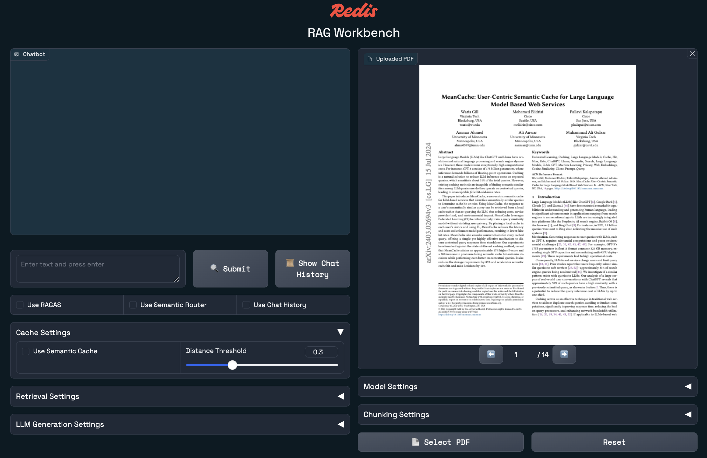

<div align="center">
<div> </div>
<h1>RAG workbench</h1>

[](https://opensource.org/licenses/MIT)


</div>

🛠️ **Redis RAG workbench** is a development playground for exploring Retrieval-Augmented Generation (RAG) techniques with Redis. Upload a PDF and begin building a RAG app to chat with the document, taking full advantage of Redis features like **vector search**, **semantic caching**, **LLM memory**, and **semantic routing**.

<div></div>

- [Prerequisites](#prerequisites)
- [Getting started](#getting-started)
  - [Run in docker](#run-in-docker)
  - [Run locally outside docker](#run-locally-outside-docker)
  - [Other useful scripts](#other-useful-scripts)
- [Using Google VertexAI](#using-google-vertexai)
- [Project Structure](#project-structure)
- [Contributing](#contributing)
- [License](#license)
- [Connecting to Redis Cloud](#connecting-to-redis-cloud)
- [Troubleshooting](#troubleshooting)
  - [Apple Silicon (M1+)](#apple-silicon-m1)
- [Learn more](#learn-more)


## Prerequisites

1. Make sure you have the following tools available:
   - [Docker](https://www.docker.com/products/docker-desktop/)
   - [uv](https://docs.astral.sh/uv/)
   - [make](https://www.make.com/en)
2. Setup one or more of the following:
   - [OpenAI API](https://platform.openai.com/)
     - You will need an API Key
   - [Azure OpenAI](https://azure.microsoft.com/en-us/products/ai-services/openai-service)
     - You will need an API Key
   - [Google VertexAI](https://cloud.google.com/vertex-ai?hl=en)
     - [Using Google VertexAI](#using-google-vertexai)
3. Get a [Cohere API key](https://cohere.com/) (for optional reranking features)


## Getting started

Clone the repository:

```bash
git clone https://github.com/redis-developer/redis-rag-workbench.git
cd redis-rag-workbench
```

Copy and edit the `.env` file:

```bash
cp .env.example .env
```

Your `.env` file should contain your Redis connection string as well as necessary API keys based on which platform(s) you want to use.

Your `.env.docker` file will look similar to `.env`, but should use the appropriate docker internal URLs. Here is
an example:

```bash
REDIS_URL="redis://redis:6379"
```

### Run in docker

To spin up docker containers:

```bash
make docker
```

> This will start the server, and you can access the workbench by navigating to `http://localhost:8000` in your web browser.

<div> </div>

> The first time the application runs, it will have to download model weights from huggingface and may take a few minutes.

### Run locally outside docker

To run the server outside of docker you need to first create a `.venv`:

```bash
make install && source .venv/bin/activate
```

From then on, you can run a dev server:

```bash
make dev
```

Or a production server:

```bash
make serve
```

### Other useful scripts

Get help for all `make` commands:

```bash
make
```

Formatting code:

```bash
make format
```

Cleaning up files:

```bash
make clean
```

## Using Google VertexAI
The workbench can be used with VertexAI, but requires you to set up your credentials using the `gcloud` CLI. The easiest way to do this is as follows:

1. Make sure you have a [gcloud project setup](https://cloud.google.com/vertex-ai/docs/start/cloud-environment) with the VertexAI API enabled.
2. Install the [gcloud CLI](https://cloud.google.com/sdk/docs/install)
3. Follow the instructions to run the [`gcloud auth application-default login`](https://cloud.google.com/docs/authentication/application-default-credentials#personal) command
4. Copy the JSON from the generated `application_default_credentials.json` into your `.env` file using the `GOOGLE_APPLICATION_CREDENTIALS` variable
5. Set the `GOOGLE_CLOUD_PROJECT_ID` environment variable in your `.env` file to the associated gcloud project you want to use.

## Project Structure

- `main.py`: The entry point of the application
- `demos/`: Contains workbench demo implementation
- `shared_components/`: Reusable utilities and components
- `static/`: Static assets for the web interface

## Contributing

🤝 Contributions are welcome! Please feel free to submit a Pull Request.

## License

This project is licensed under the MIT License - see the LICENSE file for details.

## Connecting to Redis Cloud

If you don't yet have a database setup in Redis Cloud [get started here for free](https://redis.io/try-free/).

To connect to a Redis Cloud database, log into the console and find the following:

1. The `public endpoint` (looks like `redis-#####.c###.us-east-1-#.ec2.redns.redis-cloud.com:#####`)
1. Your `username` (`default` is the default username, otherwise find the one you setup)
1. Your `password` (either setup through Data Access Control, or available in the `Security` section of the database
   page.

Combine the above values into a connection string and put it in your `.env` and `.env.docker` accordingly. It should
look something like the following:

```bash
REDIS_URL="redis://default:<password>@redis-#####.c###.us-west-2-#.ec2.redns.redis-cloud.com:#####"
```

## Troubleshooting

### Apple Silicon (M1+)

If you find that `docker` will not work, it's possible you need to add the following line in the Dockerfile (commented out in the Dockerfile for ease-of-use):

```dockerfile
RUN apt-get update && apt-get install -y build-essential
```

## Learn more

To learn more about Redis, take a look at the following resources:

- [Redis Documentation](https://redis.io/docs/latest/) - learn about Redis products, features, and commands.
- [Learn Redis](https://redis.io/learn/) - read tutorials, quick starts, and how-to guides for Redis.
- [Redis Demo Center](https://redis.io/demo-center/) - watch short, technical videos about Redis products and features.
